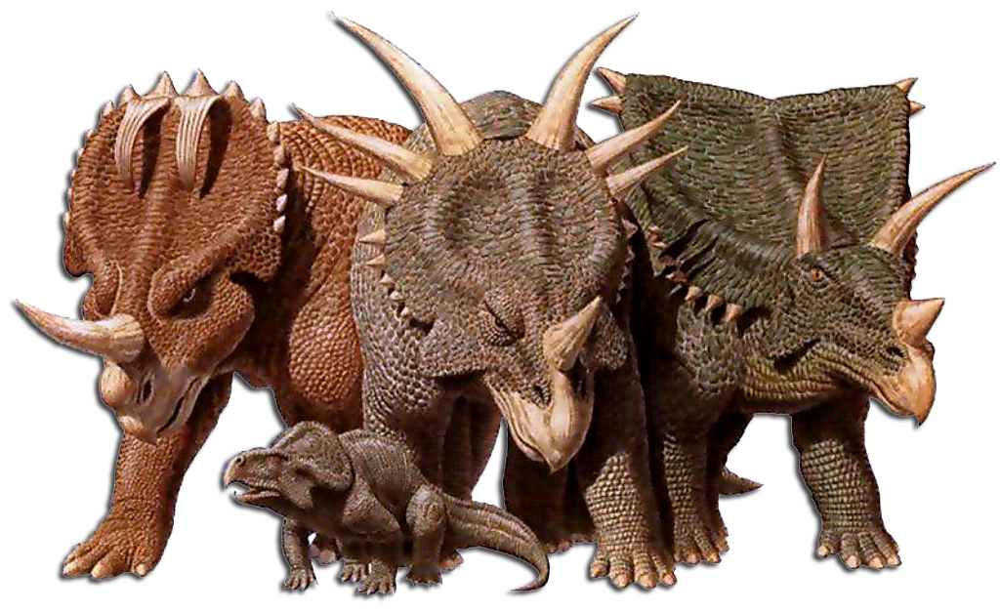
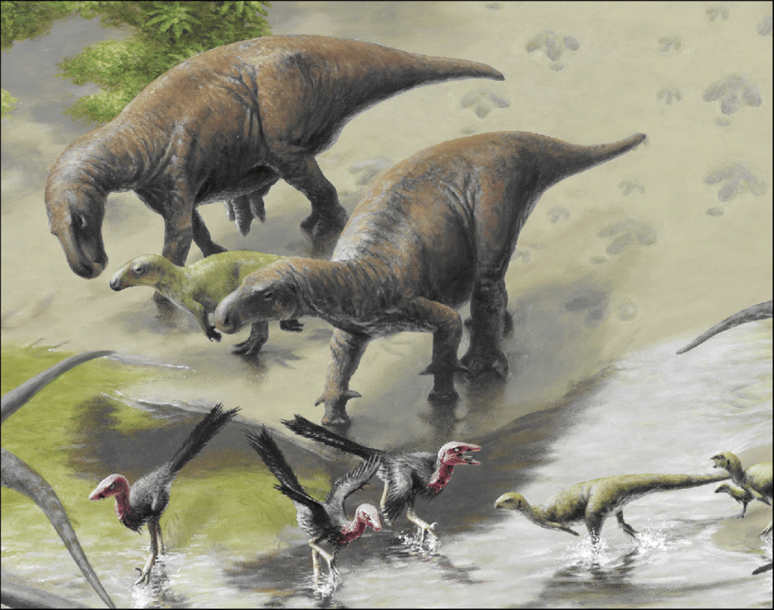
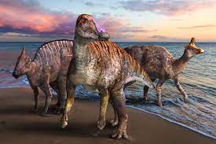
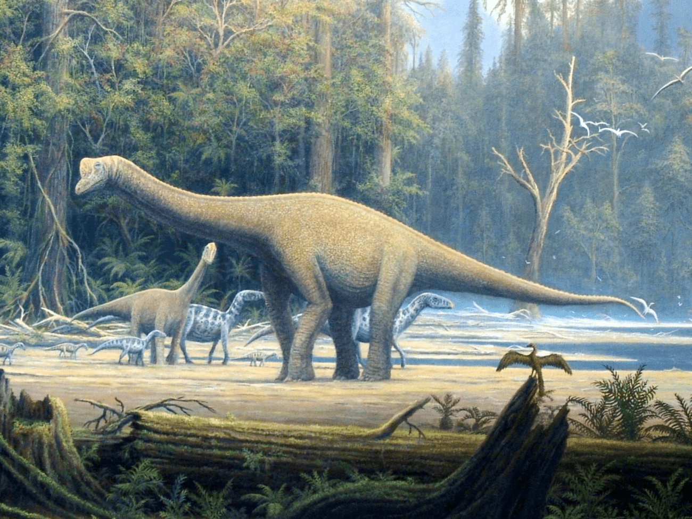

# Plant-eating Dinosaur Fun Facts

> This website is gonna tell you about a bunch of different dinosaur facts.

## Ceratopsians

They are the horned dinosaus.

### Triceratops

_try-serra-tops_

_When: 76-66 million years ago (late Cretaceous)_

Triceratops had a big frill that was probably for display. But its horns were a weapon to get meat-eating dinosaurs away. It was as heavy as a 10-ton truck. Triceratops was built like a huge rhinoceros. It lived at the end of late Cretaceous. That's it for triceratops.

### Styracosaurus (my favorite)

_sty-rack-oh-sore-us_

_When: 74-66 million years ago (late Cretaceous. A lot of ceratopsians lived at that time.)_

Styracosaurus had one horn and a big frill. Styracosaurus had big, sharp spikes on the frill. It was about the same size as a human. That's in for styracosaurus.

### Protoceratops

_pro-toe-serra-tops_

_When: 74-66 million years ago (late Cretaceous)_

Protoceratops was the smallest ceratopsian ever discovered. Protoceratops had one tiny horn and a small frill. That's in for protoceratops.

That's not all the ceratopsians, but I think we can move on.

## Iguanodontians

Most of them have sharp thumb spikes.

### Iguanodon

_ig-gwah-no-don_

_When: 135-125 million years ago (eary Cretaceous)_

It had a very big thumb spike that was probably used for defense. It was four-legged and it was a lot bigger than a human!! It could stand on two legs and four legs. That's it for iguanodon.

I don't know that much about any other iguanodontians.

## Hadrosaurs

Most of them had crests.

### Parasaurolophus

_pa-ra-sore-oh-loaf-us_

_When: 76-74 million years ago (late Cretaceous)_

It had a big crest to make sound. It was probably the same size as iguanodon. It probably lived in groups.

### Maiasaura

_my-a-sore-a_

_When: 80-74 million years ago (late Cretaceous)_

It was a very good mother, and father. It made nests and had a lot of eggs.

### Corythosaurus

_ko-rith-oh-sore-us_

_When: 76-75 million years ago (late Cretaceous)_

It also had a large crest to make sound but it was in a different shape. Probably the same size as parasaurolophus. It walked on four legs.

## Ankylosaurs

They are the armored ones.

### Ankylosaurus

_ank-ill-oh-sore-us_

_When: 70-66 million years ago (late Cretaceous)_

It had a giant club tail and it used it to battle predators. It was the biggest ankylosaur. It had armor all over it. And its name means "armored head."

### Gargoyleosaurus

_gar-goil-oh-sore-us_

_When: 155-145 million years ago (late Jurassic)_

It was a very small dinosaur. Same size as a goat. It had armor all down it, but in the place where its back connected to its tail was a big plate of armor. It did not have a club tail.

### Gastonia

_gas-toe-nee-ah_

_When: 125 mill years ago (early Cretaceous)_

When it swings its tail the spikes on its tail cross each other acting like a big weapon. It was probably the same size as a human. It was 13 feet long (4 meters). It had spikes all over it except on its belly. Its legs were like elephant legs! It's a very cool dinosaur.

That's it for the category.

## Sauropods and Titanosaurs

They are the huge, long-necked ones. And the four-footed ones.

### Brachiosaurus

_brackee-oh-sore-us_

_When: 150-145 million years ago (ooooh, late Jurassic!)_

_Length: 75 ft (23 m)_

Brachiosaurus is distinctive with a large crest from its eye to where its mouth starts. Like the others, it has a long neck, but it's the only one that's neck is slanted and then straight up.

### Barapasaurus

_buh-rah-pah-sore-us_

_When: 189-176 million years ago (early Jurassic)_

_Length: 59 ft (18 m)_

It has the longest legs of any sauropod. It's the only one that has a short tail. It has teeth that are all in a row, like all combined together into one grinder. It's neck is like a chain: long and sturdy. That's it for this dinosaur.

### Camarasaurus

_kam-a-ra-sore-us_

_When: 150-140 million years ago (late Jurassic)_

_Length: 59 ft (18 m)_

Why it's named Camarasaurus is because it has a head shaped like a camera! Its number one weapon is that it lives in groups. It has teeth combined like a grinder, too. It's kind of fast for its size.

### Mamenchisaurus

_ma-men-chee-sore-us_

_When: 155-145 million years ago (middle-late Jurassic)_

_Length: 85 ft (26m)_

It had a neck longer than its whole body. It was way taller than Brachiosaurus! It had long, thin, roundish legs. If you saw it, it would be hard to make out its head because its head was the same size as its neck! That's it for this dinosaur.

### Vulcanodon

_vul-kan-o-don_

_When: Early Jurassic_

_Length: 23 ft (7 m)_

It was one of the smallest sauropods. It was also one of the shortest sauropods. You would think it had short and thin legs, but it actually had wide and kind of long legs.

### Isanosaurus

_ee-sahn-oh-sore-us_

_When: 216-199 million years ago (late Triassic, our first Triassic dinosaur!)_

_Length: 40 ft (12 m)_

It was even shorter than vulcanodon. I would compare it to a rhino. They lived in groups. And their first defense method was groups, just like the camarasaurus. These dinosaurs had teeth more apart from each other than a human's teeth! They had small eyes. And that's why they lived in groups.

### Diplodocus

_dip-lod-oh-kus_ or _di-plod-uh-kus_

_When: 150-145 million years ago (late Jurassic)_

_Length: 86 ft (26 m)_

It's the same size as memenchosaurus and it used its tail like a whip to fight danger! What makes it so big was that its tail was as long as camarasaurus!

### Amargasaurus

_ah-mar-gah-sore-us_

_When: 130 million years ago (early Cretaceous)_

_Length: 36 ft (11 m)_

It had a giant sail running from the tip of its neck down to its tail. But now scientists think it was one sail divided into two sails. It might have walked in shallow water to get away from predators. It had a long tail.

### Barosaurus

_bah-roe-sore-us_

_When: 155-145 million years ago (late Jurassic)_

_Length: 92 ft (28 m)_

They lived in herds. They had spikes down their neck to their tail. They probably lived in rain forests.

Up next, these are the titanosaurs.
### Nemegtosaurus

_nem-egg-toe-sore-us_

_When: 86-66 million years ago (late Cretaceous)_

_Length: 50 ft (15 m)_

It had teeth together combined into one grinder, too. It had a very long neck. Its head could eat a branch.

### Argentinosaurus

_are-gen-teen-oh-sore-us_

_When: 112-95 million years ago (late Cretaceous)_

_Length: 100 ft (30 m)_

It's a titanosaur. It had teeth that could eat a branch, too. It's giant. Its head was the same size as its neck, too.

## Questions and answers

This section has a bunch of different questions and answers. And in the middle is joke time!

### Question 1: Is it true that when gastonia swung its tail, its spikes crossed like scissors?

Answer: Yes! It used them for defense.

### Question 2: Is it true that styracosaurus had one long spike on its nose?

Answer: Yes! It used it like tricerotops: to charge and it also used it for defense.

### Question 3: Is it true that tricerotops lived in the Jurassic period?

Answer: No! It lived in late Cretaceous.

### Question 4: Is it true that iguanodon was 35 feet long?

Answer: No! It was 30 feet long.

### Question 5: Is it true that maiasaura wasn't a very good mother?

Answer: No!! It was actually a very good mother. We found it sitting on a nest even when the asteroid killed the dinosaurs it wanted to keep its babies safe.

### Question 6: Is it true that corythosaurus had a crest on its head?

Answer: Yes! It used it to make sound.

### Question 7: Is it true that memechosaurus wasn't that tall?

Answer: No! It was actually very tall.

### Joke time!

Knock, knock

Who's there?

Interrupting brachiosaurus.

Interrupting brachio-AAAAAAAAAA!

----

Knock, knock

Who's there?

T. Rex go

T. Rex go who?

No, silly, T. Rex go roar!!

----

What’s a dentist’s favorite dinosaur?

A floss-iraptor.

----

Why are sauropods such good story tellers?

Because they have long tails.

----

Why did the Archaeopteryx catch the worm?

Because it was an early bird!

----

Why did the Tyrannosaurus Rex cross the road?

Because the chickens hadn’t evolved yet.

### Question 8: Why isn't pterodactyl a real thing?

Because its beak was from a pterodactylus, its wings were from a quetzalcoatlus, and its body a tail were from a ramphorinkus. A paleontologist found all these bones in the same place and thought they belonged together, but they did NOT.

### Question 9: Why don't you have any pterosaurs on this page?

Because pterosaurs aren't dinosaurs! They are flying reptiles.
