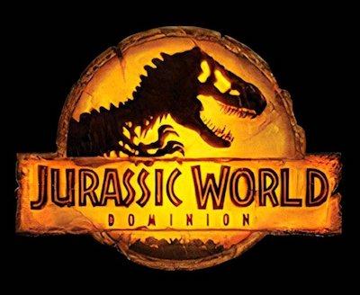
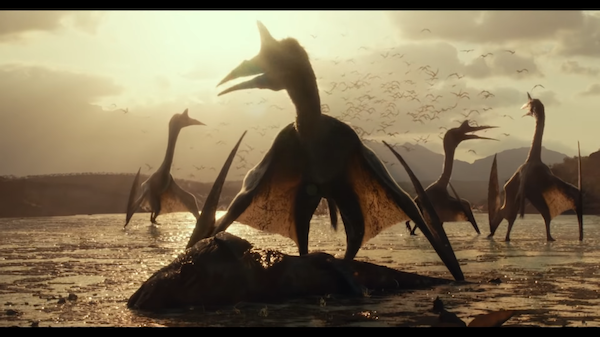
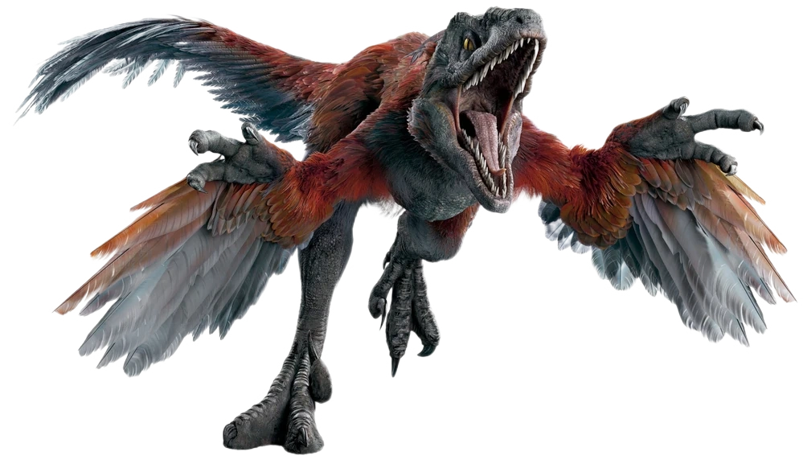
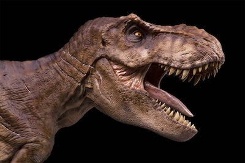
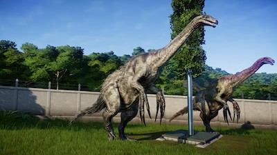

# Jurassic World Dominion Dinos

> On this page you'll find information about many different Dominion dinosaurs including the very little-known pyroraptor and atrociraptor.

## Giganotosaurus

_jig-uh-no-toe-sore-us_

In Jurassic World, the giganotosaurus was black and grey. It had an EPIC... battle with a T-rex. Giganotosaurus is my second favorite dinosaur.

## Quetzelcoatlus

_kwet-sul-ko-ot-lus_

Once it attacked a plane.

## Pryoraptor

_paay-roe-rap-tor_

It ran at Owen and someone else on a bridge. It also attacked the same two people on ice. That is my favorite dinosaur.

## Atrociraptor

_uh-tross-uh-rap-tor_

A group of atrociraptors including Ghost, Red, Tiger, and more chased Owen on a motorcycle. They're really powerful hunters.

## Tyranosaurus Rex

_tie-ran-oh-sore-us recks_

It battles the giganotosaurus.

## Therizinosaurus

_thare-oh-zin-oh-sore-us_

In the movie it scares Claire, it also is part of the giganotosaurus battle. And it wins!
